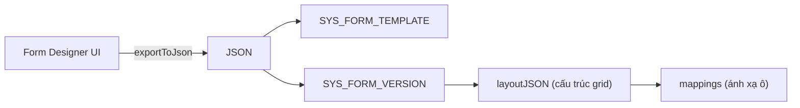
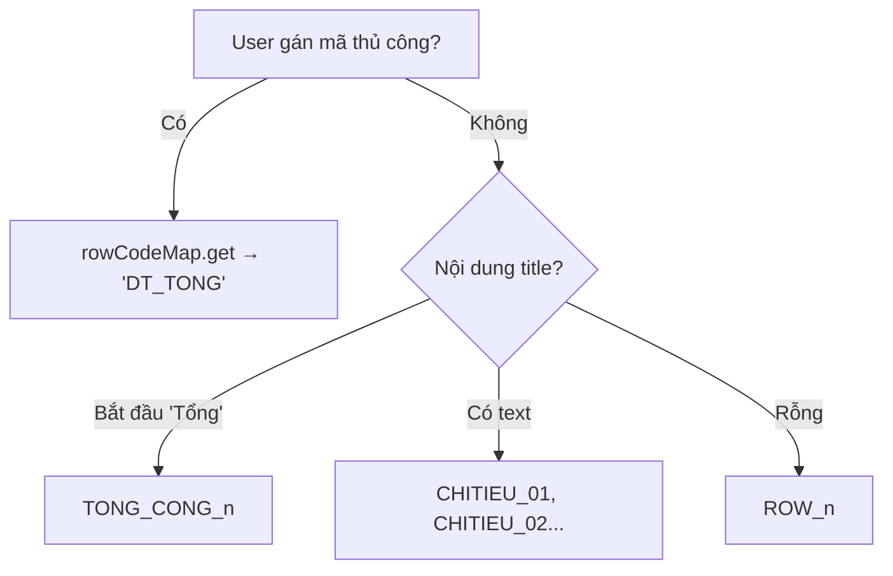
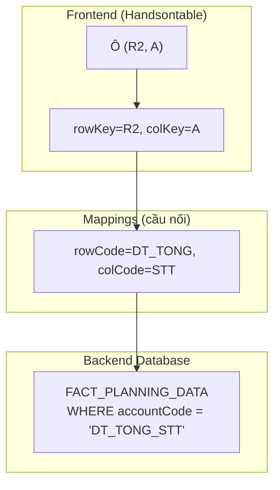
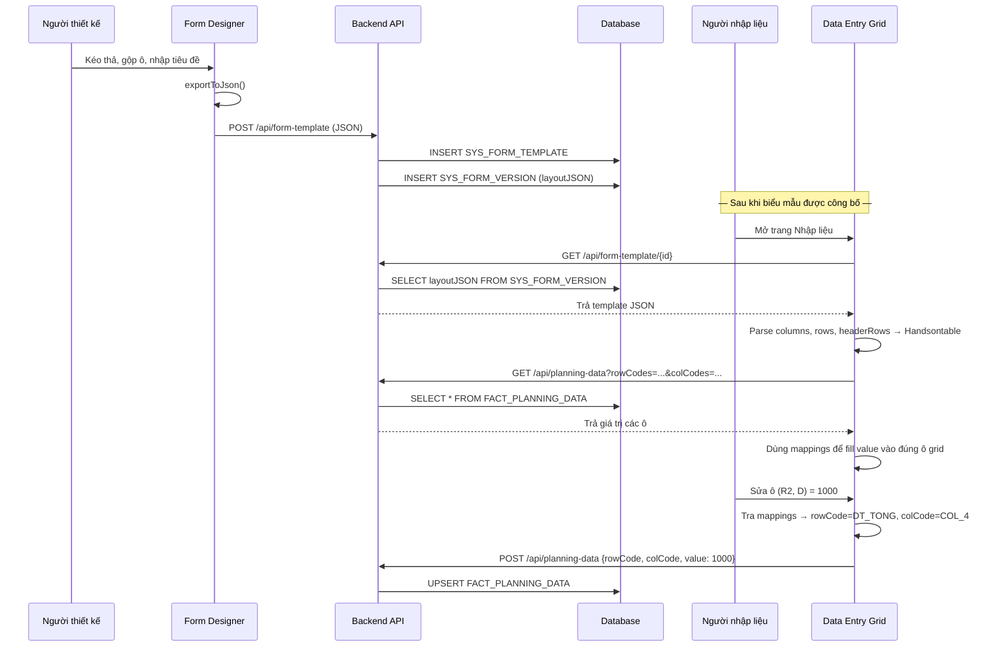

# Giải thích chi tiết JSON Export — Form Designer

## Tổng quan kiến trúc

JSON này là **bản thiết kế hoàn chỉnh của 1 biểu mẫu** — được tạo ra từ Form Designer UI và gửi xuống Backend để lưu vào 2 bảng chính trong DB:



---

## 1. Metadata biểu mẫu (→ lưu vào `SYS_FORM_TEMPLATE`)

```json
{
  "formId": "NEW_TEMPLATE",
  "formName": "Biểu mẫu mới",
  "orgList": ["EVN", "EVNHCMC", "EVNHANOI"],
  "isDynamicRow": false
}
```

| Field | Ý nghĩa | Sinh ra từ đâu |
|---|---|---|
| `formId` | **Mã biểu mẫu** — primary key, duy nhất trong hệ thống | User nhập trong dialog "Thông tin biểu mẫu" khi tạo mới. Nếu không nhập → `"NEW_TEMPLATE"` |
| `formName` | **Tên hiển thị** — dùng trên danh sách biểu mẫu, tiêu đề báo cáo | User nhập trong dialog "Tên biểu mẫu" |
| `orgList` | **Danh sách đơn vị** được phép dùng mẫu này | Mảng entity codes. Mặc định `["EVN", "EVNHCMC", "EVNHANOI"]`. User có thể thêm/bớt trong panel Thông tin |
| `isDynamicRow` | **Cho phép thêm dòng** khi nhập liệu hay không | `false` = grid cố định (user nhập liệu không được thêm dòng). `true` = grid động (dùng cho danh sách đầu tư, hợp đồng…) |

> **Backend dùng để làm gì?** Lưu vào bảng `SYS_FORM_TEMPLATE`. Khi user mở trang Nhập liệu → BE query danh sách biểu mẫu theo `orgList` để lọc mẫu phù hợp cho đơn vị đó.

---

## 2. Cấu hình layout (`layoutConfig`)

```json
"layoutConfig": {
  "type": "custom",
  "allowDynamicRows": false,
  "freezeColumns": 1,
  "hiddenColumns": {
    "columns": [0],
    "indicators": false
  }
}
```

| Field | Ý nghĩa | Sinh ra từ đâu |
|---|---|---|
| `type` | Loại layout: `"custom"` = tự thiết kế | Luôn là `"custom"` từ Form Designer |
| `allowDynamicRows` | Giống `isDynamicRow` — lưu thêm ở đây cho tiện | Copy từ `isDynamicRow` |
| `freezeColumns` | **Số cột cố định** bên trái khi cuộn ngang | = `fixedCols + 1` (thêm 1 cho cột ẩn METADATA_ROW ở index 0) |
| `hiddenColumns.columns` | **Chỉ mục cột bị ẩn** | `[0]` = luôn ẩn cột METADATA_ROW (cột đầu tiên, dùng nội bộ) |
| `hiddenColumns.indicators` | Hiển thị icon báo cột bị ẩn | `false` = không hiện icon |

> **Backend dùng để làm gì?** Khi frontend load xong template, đọc `layoutConfig` để cấu hình Handsontable: freeze cột, ẩn cột metadata. Backend lưu nguyên object này.

---

## 3. Version (`version`)

```json
"version": {
  "year": 2026,
  "layoutJSON": { ... }
}
```

| Field | Ý nghĩa | Sinh ra từ đâu |
|---|---|---|
| `year` | **Năm hiệu lực** — mỗi năm có thể khác layout | User nhập trong dialog Thông tin. Mặc định = năm hiện tại (2026) |
| `layoutJSON` | **Toàn bộ cấu trúc grid** — phần cốt lõi | Được [exportToJson()](file:///d:/EVN/KHTC/khtc-frontend/src/app/features/form-designer/pages/form-builder/thiet-ke-bieu-mau.component.ts#1024-1190) build từ trạng thái Handsontable |

> **Backend lưu vào** bảng `SYS_FORM_VERSION`. Mỗi biểu mẫu có thể nhiều version (1 version/năm). `layoutJSON` được lưu dạng JSON string trong DB.

---

## 4. Columns — Định nghĩa cột (`layoutJSON.columns`)

```json
"columns": [
  {"key": "ID", "colCode": "METADATA_ROW", "title": "RowCode", "width": 0, "type": "text", "readOnly": true},
  {"key": "A",  "colCode": "STT",          "title": "STT",          "width": 50,  "type": "numeric", "readOnly": true},
  {"key": "B",  "colCode": "CHITIEU_NAME", "title": "Chỉ tiêu",    "width": 200, "type": "text",    "readOnly": true},
  {"key": "C",  "colCode": "UNIT",         "title": "Đơn vị tính",  "width": 100, "type": "numeric", "readOnly": true},
  {"key": "D",  "colCode": "COL_4",        "title": "Cột 1",        "width": 120, "type": "text",    "readOnly": false}
]
```

| Field | Ý nghĩa | Sinh ra từ đâu |
|---|---|---|
| `key` | **Tọa độ cột** dạng chữ cái: A, B, C… hoặc `"ID"` cho cột ẩn | Tự động sinh bởi [colIndexToKey(c)](file:///d:/EVN/KHTC/khtc-frontend/src/app/features/form-designer/pages/form-builder/thiet-ke-bieu-mau.component.ts#1295-1304). Cột ẩn luôn là `"ID"` |
| `colCode` | **Mã ngữ nghĩa** — duy nhất, dùng làm key khi lưu/load dữ liệu | Được xác định bởi [generateColCode()](file:///d:/EVN/KHTC/khtc-frontend/src/app/features/form-designer/pages/form-builder/thiet-ke-bieu-mau.component.ts#1213-1244) dựa trên tiêu đề cột, hoặc user gán thủ công qua panel Mã chỉ tiêu |
| `title` | **Tiêu đề hiển thị** trên header grid | Lấy từ nội dung cell header dòng cuối cùng: [resolveColumnTitle()](file:///d:/EVN/KHTC/khtc-frontend/src/app/features/form-designer/pages/form-builder/thiet-ke-bieu-mau.component.ts#1329-1337) |
| `width` | **Độ rộng pixel** | Lấy từ `hot.getColWidth(c)` — user kéo resize cột bao nhiêu lưu bấy nhiêu |
| `type` | Kiểu dữ liệu: `"text"` or `"numeric"` | [inferColumnType()](file:///d:/EVN/KHTC/khtc-frontend/src/app/features/form-designer/pages/form-builder/thiet-ke-bieu-mau.component.ts#1338-1374) phân tích giá trị các cell trong cột: nếu toàn số → numeric, có text → text |
| `readOnly` | Cột chỉ đọc? | `true` nếu là STT, CHITIEU_NAME, UNIT, hoặc cột nằm trong vùng freeze |

### Giải thích `colCode` chi tiết

```mermaid
flowchart TD
    A[User gán mã thủ công?] -->|Có| B[columnCodeMap.get]
    A -->|Không| C[generateColCode tự suy]
    C --> D{Tiêu đề cột}
    D -->|"STT" / "Số thứ tự" / rỗng + index 0| E["STT"]
    D -->|"Chỉ tiêu" + index 1| F["CHITIEU_NAME"]
    D -->|"Đơn vị tính"| G["UNIT"]
    D -->|"Ghi chú"| H["NOTE"]
    D -->|"Thực hiện"| I["ACTUAL_Nx"]
    D -->|"Kế hoạch"| J["PLAN_Nx"]
    D -->|Khác| K["COL_n"]
```

> **Backend dùng để làm gì?** `colCode` là **half of the cell key**. Khi lưu giá trị ô vào `FACT_PLANNING_DATA`, Backend dùng `rowCode × colCode` để xác định ô nào. Ví dụ: ô doanh thu năm N = `DT_TONG × COL_4`.

---

## 5. Header Rows — Dòng tiêu đề (`layoutJSON.headerRows`)

```json
"headerRows": [
  {
    "cells": [
      {"label": "",             "colKey": "ID", "rowspan": 1},
      {"label": "STT",          "colKey": "A"},
      {"label": "Chỉ tiêu",    "colKey": "B"},
      {"label": "Đơn vị tính", "colKey": "C"},
      {"label": "Cột 1",       "colKey": "D"}
    ]
  }
]
```

| Field | Ý nghĩa | Sinh ra từ đâu |
|---|---|---|
| `headerRows` | **Mảng các dòng header** — bảng phức tạp có 2-3 tầng header gộp cột | [buildHeaderRows()](file:///d:/EVN/KHTC/khtc-frontend/src/app/features/form-designer/pages/form-builder/thiet-ke-bieu-mau.component.ts#1426-1490) duyệt các dòng trước `headerRowCount` |
| `cells[].label` | **Text hiển thị** trên header | Lấy trực tiếp từ `sourceData[row][col]` |
| `cells[].colKey` | **Tọa độ cột** tương ứng | = [colIndexToKey(c)](file:///d:/EVN/KHTC/khtc-frontend/src/app/features/form-designer/pages/form-builder/thiet-ke-bieu-mau.component.ts#1295-1304) hoặc `"ID"` cho cột ẩn |
| `cells[].rowspan` | Số dòng gộp dọc (chỉ ghi nếu > 1) | Tính từ mergeCells: nếu cell ở row 0 merge xuống 2 dòng → `rowspan: 2` |
| `cells[].colspan` | Số cột gộp ngang (chỉ ghi nếu > 1) | Tính từ mergeCells: nếu "Thực hiện" merge 3 cột → `colspan: 3` |

> **Backend dùng để làm gì?** Frontend đọc `headerRows` để render Handsontable `nestedHeaders`. Backend lưu nguyên, không cần parse.

---

## 6. Rows — Định nghĩa dòng (`layoutJSON.rows`)

```json
"rows": [
  {"rowKey": "R2", "rowCode": "DT_TONG", "title": "Tổng doanh thu", "level": 0, "isReadOnly": false},
  {"rowKey": "R3", "rowCode": "ROW_2",   "title": "",               "level": 0, "isReadOnly": false}
]
```

| Field | Ý nghĩa | Sinh ra từ đâu |
|---|---|---|
| `rowKey` | **Tọa độ dòng**: `"R2"` = dòng grid thứ 2 (sau header) | Tự sinh: `R${rowIndex + 1}`. R1 = header, nên data bắt đầu từ R2 |
| `rowCode` | **Mã ngữ nghĩa** — duy nhất, dùng làm key khi lưu/load | [buildLayoutRows()](file:///d:/EVN/KHTC/khtc-frontend/src/app/features/form-designer/pages/form-builder/thiet-ke-bieu-mau.component.ts#1245-1294) xác định: xem bảng dưới |
| `title` | **Tên chỉ tiêu** hiển thị ở cột Chỉ tiêu | Lấy từ cột B (index 1) của dòng đó, trim() |
| `level` | **Mức lùi đầu dòng**: 0 = gốc, 1 = con, 2 = cháu | Đếm khoảng trắng đầu dòng ÷ 2. Ví dụ: `"  Chi phí nhân công"` → level 1 |
| `isReadOnly` | Dòng chỉ đọc (dòng tổng, dòng header phần) | `true` nếu cột STT có mẫu `I.`, `II.`, `A.` (Roman numeral) |

### Logic sinh `rowCode`



> **Backend dùng để làm gì?** `rowCode` là **half of the cell key** còn lại. Ví dụ: `rowCode: "DT_TONG"` + `colCode: "COL_4"` → ô chứa giá trị "Tổng doanh thu" ở cột số liệu 1.

---

## 7. FixedRowsTop & FreezeColumns

```json
"fixedRowsTop": 1,
"freezeColumns": 1
```

| Field | Ý nghĩa | Sinh ra từ đâu |
|---|---|---|
| `fixedRowsTop` | **Số dòng header cố định** — không cuộn khi scroll dọc | = `headerRowCount` (tự detect từ mergeCells) hoặc user set thủ công |
| `freezeColumns` | **Số cột cố định** — không cuộn khi scroll ngang | = `fixedCols + 1` (thêm 1 cho cột ẩn METADATA_ROW) |

> **Backend dùng để làm gì?** Frontend đọc để cấu hình `fixedRowsTop` và `fixedColumnsStart` trong Handsontable.

---

## 8. Mappings — Ánh xạ ô (`layoutJSON.mappings`)

```json
"mappings": [
  {"rowKey":"R2", "colKey":"A", "rowCode":"DT_TONG", "colCode":"STT",          "cellRole":"data", "isReadOnly":true},
  {"rowKey":"R2", "colKey":"B", "rowCode":"DT_TONG", "colCode":"CHITIEU_NAME", "cellRole":"data", "isReadOnly":true},
  {"rowKey":"R2", "colKey":"D", "rowCode":"DT_TONG", "colCode":"COL_4",        "cellRole":"data", "isReadOnly":false}
]
```

| Field | Ý nghĩa | Sinh ra từ đâu |
|---|---|---|
| `rowKey` | **Tọa độ vật lý dòng**: R2, R3… | Từ vòng lặp body rows: `R${r + 1}` |
| `colKey` | **Tọa độ vật lý cột**: A, B, C… | Từ [colIndexToKey(c)](file:///d:/EVN/KHTC/khtc-frontend/src/app/features/form-designer/pages/form-builder/thiet-ke-bieu-mau.component.ts#1295-1304) |
| `rowCode` | **Mã ngữ nghĩa dòng** — copy từ `rows[].rowCode` | Đã resolve ở bước buildLayoutRows |
| `colCode` | **Mã ngữ nghĩa cột** — copy từ `columns[].colCode` | Đã resolve ở bước columns builder |
| `cellRole` | **Vai trò ô**: `"data"` / `"formula"` / `"header"` / `"text"` | Xác định bởi metadata hoặc vị trí cột |
| `formula` | **Công thức HyperFormula** (nếu có): `"=SUM(D2:D5)"` | Chỉ xuất hiện khi `cellRole === "formula"`. Lấy từ HyperFormula engine |
| `isReadOnly` | **Ô chỉ đọc?** | `true` nếu: formula, header, text, hoặc cột là STT/CHITIEU_NAME/UNIT |

### Ý nghĩa kiến trúc của Mappings



> **Backend dùng mappings để làm gì?**
> 1. **Load dữ liệu**: Backend có `FACT_PLANNING_DATA` chứa [(rowCode, colCode, value)](file:///d:/EVN/KHTC/khtc-frontend/src/app/features/form-designer/pages/form-builder/thiet-ke-bieu-mau.component.ts#1379-1385). Đọc mappings để biết ô (R2, A) cần fill giá trị từ record có `rowCode=DT_TONG, colCode=STT`.
> 2. **Save dữ liệu**: Khi user sửa ô (R2, D), Frontend tra mappings → `rowCode=DT_TONG, colCode=COL_4` → gửi `{rowCode, colCode, value}` xuống BE.
> 3. **Xác định ô nào readOnly**: BE biết ô nào user được sửa, ô nào tự tính.
> 4. **Tính công thức**: Nếu `formula` có giá trị, BE hoặc FE dùng HyperFormula để tính.

---

## Bảng tóm tắt: Mỗi phần map tới đâu trong hệ thống

| Phần JSON | Lưu ở DB | Dùng ở Frontend | Dùng ở Backend |
|---|---|---|---|
| `formId`, `formName`, `orgList` | `SYS_FORM_TEMPLATE` | Hiển thị tên, lọc theo đơn vị | Query biểu mẫu |
| `layoutConfig` | `SYS_FORM_TEMPLATE` | Cấu hình Handsontable | Trả về cho FE |
| `version.year` | `SYS_FORM_VERSION` | Lọc theo năm | Versioning |
| `layoutJSON.columns` | `SYS_FORM_VERSION.layoutJSON` | Render cột grid | Biết cấu trúc cột |
| `layoutJSON.headerRows` | `SYS_FORM_VERSION.layoutJSON` | Render header gộp | Không dùng trực tiếp |
| `layoutJSON.rows` | `SYS_FORM_VERSION.layoutJSON` | Render danh sách chỉ tiêu | Map `rowCode` |
| `layoutJSON.mappings` | `SYS_FORM_VERSION.layoutJSON` | Load/Save từng ô | Map `rowCode×colCode` → DB |

---

## Luồng hoạt động End-to-End


