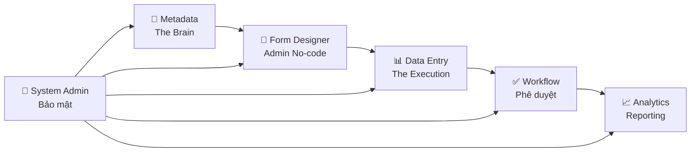
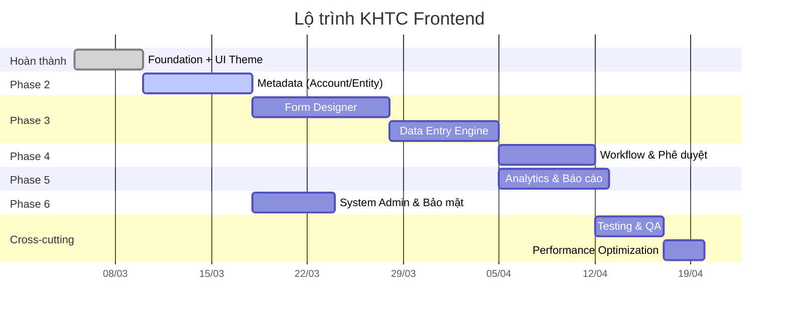

# Kế hoạch Triển khai Dự án KHTC
## Hệ thống Kế hoạch Tài chính — Tập đoàn Điện lực Việt Nam (EVN)

---

## 1. Tổng quan dự án

| Mục | Nội dung |
|---|---|
| **Tên dự án** | KHTC — Hệ thống Kế hoạch Tài chính EVN |
| **Mục tiêu** | Nền tảng "Excel trên Web" để 30+ đơn vị thành viên nhập kế hoạch tài chính, tự động tổng hợp, phê duyệt và báo cáo đa chiều |
| **Stack** | Angular 19 · PrimeNG 19 · Handsontable 16 · HyperFormula · Chart.js · SCSS |
| **Kiến trúc** | Standalone Components · Signal-based State · Lazy-loaded Feature Modules |
| **Môi trường** | Intranet (Offline First) — không CDN, tất cả bundle nội bộ |

### Phân hệ chức năng

---

## 2. Tiến độ hiện tại

| Phase | Trạng thái | Mô tả |
|---|---|---|
| Phase 0: Foundation | ✅ Hoàn thành | Project init, core module, layout shell, design system |
| Phase 1: UI Theme | ✅ Hoàn thành | EVN Workflow style (blue `#1E38C3`), narrow sidebar, clean data table |
| Phase 2–6 | 🔲 Chưa bắt đầu | Feature modules (chi tiết bên dưới) |

---

## 3. Kế hoạch triển khai chi tiết

### Phase 2: Quản trị Metadata — "The Brain" 🧠
> **Mục tiêu**: Thiết lập "ngôn ngữ chung" cho toàn hệ thống.

| # | Task | Deliverable | Độ phức tạp |
|---|---|---|---|
| 2.1 | **CRUD Account (Chỉ tiêu)** — DataTable + TreeTable | Trang quản lý chỉ tiêu với cây cha-con, thêm/sửa/xóa, tìm kiếm | ⭐⭐⭐ |
| 2.2 | **Drag & Drop Hierarchy** — Kéo thả cây chỉ tiêu | Component Account Tree Editor cho phép kéo thả sắp xếp cây | ⭐⭐⭐⭐ |
| 2.3 | **Thuộc tính Account** — Store/Dynamic Calc, UOM | Panel chi tiết: Data Storage, Aggregation, Đơn vị tính, Tiền tệ | ⭐⭐ |
| 2.4 | **CRUD Entity (Đơn vị)** — DataTable + Hierarchy | Trang quản lý đơn vị thành viên (PC, Tổng công ty, Tập đoàn) | ⭐⭐ |
| 2.5 | **CRUD Version/Scenario** — Config panel | Cấu hình phiên bản (Budget, Forecast, Actual) và kịch bản | ⭐⭐ |
| 2.6 | **Mock API + JSON data** | [MockApiService](file:///d:/EVN/KHTC/khtc-frontend/src/app/core/services/mock-api.service.ts#23-317) phục vụ dev, JSON data files cho Account/Entity/Version | ⭐⭐ |

**Files chính:**
- `features/metadata/pages/account-management/`
- `features/metadata/pages/entity-management/`
- `features/metadata/pages/version-management/`
- `features/metadata/components/account-tree-editor/`
- `features/metadata/services/account.service.ts`
- `assets/mock-data/dim-account.json`, `dim-entity.json`, `dim-version.json`

---

### Phase 3: Form Designer + Data Entry Engine 📝📊
> **Mục tiêu**: Admin tự tạo mẫu biểu (No-code) và người dùng nhập liệu trên form Handsontable.

#### 3A: Form Designer (Admin No-code)

| # | Task | Deliverable | Độ phức tạp |
|---|---|---|---|
| 3A.1 | **Template List** — DataTable CRUD | Trang liệt kê mẫu biểu, nhân bản, xóa, tạo mới | ⭐⭐ |
| 3A.2 | **Form Builder** — Handsontable Designer | Canvas Handsontable cho admin thiết kế layout: merge cells, format, freeze | ⭐⭐⭐⭐⭐ |
| 3A.3 | **Mapping Panel** — Gán AccountCode vào ô | Kéo thả chỉ tiêu từ danh sách vào ô trên Handsontable | ⭐⭐⭐⭐ |
| 3A.4 | **Formula Editor** — HyperFormula | Cho phép admin nhập công thức (SUM, IF...) và validate real-time | ⭐⭐⭐⭐ |
| 3A.5 | **Template Preview & Version** | Xem trước template với mock data, quản lý version template | ⭐⭐⭐ |

#### 3B: Data Entry (The Execution)

| # | Task | Deliverable | Độ phức tạp |
|---|---|---|---|
| 3B.1 | **POV Selector** — Year/Scenario/Version/Entity | Thanh công cụ chọn điểm nhìn (POV) trước khi nhập liệu | ⭐⭐⭐ |
| 3B.2 | **Planning Grid** — Handsontable Data Entry | Render template + dữ liệu thực, cho phép nhập/sửa, auto-calc | ⭐⭐⭐⭐⭐ |
| 3B.3 | **Validation Engine** — Budget control | Cảnh báo vượt ngân sách, ô bắt buộc, kiểu dữ liệu | ⭐⭐⭐ |
| 3B.4 | **Cell Comments & Audit** — Ghi chú | Ghi chú từng ô, lịch sử thay đổi (audit trail per cell) | ⭐⭐⭐ |
| 3B.5 | **Ký Cam Kết & Nộp (Sign & Submit)** | Người dùng chốt số liệu, "Ký cam kết" tính chính xác và nộp lên cấp trên duyệt | ⭐⭐⭐⭐ |

**Files chính:**
- `features/form-designer/pages/template-list/`, `form-builder/`
- `features/form-designer/components/hot-designer/`, `mapping-panel/`, `formula-editor/`
- `features/data-entry/pages/planning-grid/`, `forecast-grid/`
- `features/data-entry/components/hot-data-grid/`, `pov-bar/`, `validation-panel/`
- `shared/components/pov-selector/`, `entity-tree-select/`

---

### Phase 4: Quy trình Phê duyệt (Workflow) ✅
> **Mục tiêu**: Hồ sơ kế hoạch đi qua quy trình phê duyệt nhiều cấp.

| # | Task | Deliverable | Độ phức tạp |
|---|---|---|---|
| 4.1 | **Submission List** — Danh sách hồ sơ | DataTable hồ sơ đã nộp/ký cam kết, lọc theo trạng thái, đơn vị | ⭐⭐ |
| 4.2 | **Approval Inbox** — Hộp duyệt đến | Danh sách hồ sơ chờ duyệt, action Approve/Reject/Return kèm chữ ký số (nếu có) | ⭐⭐⭐ |
| 4.3 | **Approval Timeline** — Lịch sử phê duyệt | Timeline hiển thị các bước duyệt, ai duyệt, thời gian, ghi chú | ⭐⭐⭐ |
| 4.4 | **Workflow Config** — Admin cấu hình | Admin thiết lập quy trình: số bước, vai trò duyệt, điều kiện | ⭐⭐⭐⭐ |
| 4.5 | **Notification** — Email/In-app | Thông báo khi có hồ sơ mới cần duyệt, kết quả duyệt | ⭐⭐ |

**Files chính:**
- `features/workflow/pages/submission-list/`, `approval-inbox/`, `workflow-config/`
- `features/workflow/components/approval-timeline/`, `action-dialog/`

---

### Phase 5: Analytics & Báo cáo 📈
> **Mục tiêu**: Dashboard lãnh đạo, so sánh Plan vs Actual, báo cáo hợp nhất.

| # | Task | Deliverable | Độ phức tạp |
|---|---|---|---|
| 5.1 | **Executive Dashboard** — KPI Cards + Charts | Dashboard KPI (Doanh thu, Chi phí, Lợi nhuận), trend charts | ⭐⭐⭐ |
| 5.2 | **Variance Report** — Plan vs Actual | Bảng so sánh kế hoạch vs thực hiện, highlight chênh lệch | ⭐⭐⭐⭐ |
| 5.3 | **Consolidation** — Báo cáo hợp nhất | Tổng hợp dữ liệu từ các đơn vị con lên Tập đoàn | ⭐⭐⭐⭐ |
| 5.4 | **Drill-down Viewer** — Chi tiết đơn vị | Click vào KPI → drill-down đến Entity cụ thể | ⭐⭐⭐ |
| 5.5 | **Export** — Excel/PDF | Xuất báo cáo sang Excel (giữ format) và PDF | ⭐⭐⭐ |

**Files chính:**
- `features/analytics/pages/executive-dashboard/`, `variance-report/`, `consolidation/`
- `features/analytics/components/kpi-card/`, `variance-chart/`, `pivot-table/`

---

### Phase 6: Quản trị Hệ thống & Bảo mật 🔐
> **Mục tiêu**: Phân quyền chi tiết, quản lý người dùng, nhật ký.

| # | Task | Deliverable | Độ phức tạp |
|---|---|---|---|
| 6.1 | **User Management** — CRUD người dùng | Trang quản lý user, gán nhóm quyền, kích hoạt/khóa | ⭐⭐ |
| 6.2 | **Role Management** — Nhóm quyền | CRUD nhóm quyền, gán quyền chức năng (menu) | ⭐⭐ |
| 6.3 | **Permission Matrix** — Phân quyền ma trận | Ma trận quyền theo Dimension: User × Entity × Scenario → Read/Write | ⭐⭐⭐⭐⭐ |
| 6.4 | **Audit Trail** — Nhật ký hệ thống | Log mọi thao tác: ai, lúc nào, thay đổi gì, IP | ⭐⭐⭐ |
| 6.5 | **Menu Management** — Cấu hình menu | Admin cấu hình menu sidebar theo vai trò | ⭐⭐ |

**Files chính:**
- `features/system-admin/pages/user-management/`, `role-management/`, `permission-matrix/`
- `shared/directives/permission.directive.ts`

---

## 4. Cross-cutting Concerns

### Testing Strategy

| Loại | Công cụ | Phạm vi |
|---|---|---|
| Unit Test | Jasmine + Karma | Services, Pipes, Utils (≥80% coverage) |
| Component Test | Angular Testing Library | UI components, form validation |
| E2E Test | Cypress | Critical flows: Login → Nhập liệu → Nộp → Duyệt |

### Performance

- **Lazy loading**: Mỗi feature module load riêng (~50-100KB/chunk)
- **Virtual scrolling**: Handsontable cho bảng >1000 dòng
- **Debounce**: Search/filter 300ms debounce
- **Cache**: [CacheService](file:///d:/EVN/KHTC/khtc-frontend/src/app/core/services/cache.service.ts#11-54) cache dimension data (TTL 5 phút)
- **Bundle budget**: Main < 500KB, mỗi lazy chunk < 150KB

### Security

- JWT HttpOnly cookie (không lưu localStorage)
- Auth Interceptor tự động attach token + refresh
- `*appHasPermission` directive kiểm tra quyền ở template level
- CSRF token cho mọi mutation request
- Input sanitization (XSS prevention)

### UX/Accessibility

- Keyboard navigation toàn bộ DataTable và Handsontable
- Loading skeletons thay vì spinner
- Toast notification cho mọi action (success/error)
- Responsive: Desktop-first, hỗ trợ tablet (≥768px)
- Vietnamese locale cho dates, numbers, currency

---

## 5. Thứ tự ưu tiên & Dependency

> [!IMPORTANT]
> **Dependency chính**: Metadata (Phase 2) phải xong trước vì Account/Entity/Version là dữ liệu nền cho Form Designer và Data Entry. Phase 5 (Analytics) và Phase 6 (Admin) có thể chạy song song.

---

## 6. Rủi ro & Biện pháp

| # | Rủi ro | Xác suất | Tác động | Biện pháp |
|---|---|---|---|---|
| R1 | Handsontable performance với >5000 dòng | Trung bình | Cao | Virtual scrolling, phân trang, lazy render |
| R2 | HyperFormula không hỗ trợ công thức VN phức tạp | Thấp | Cao | Custom formula functions, pre-compute server-side |
| R3 | API backend chưa sẵn sàng | Cao | Trung bình | MockApiService + JSON data cho phép dev độc lập |
| R4 | Phân quyền ma trận phức tạp (30+ entity × nhiều dimension) | Trung bình | Cao | Cache quyền client-side, lazy-check per-cell |
| R5 | Yêu cầu thay đổi mẫu biểu sau khi có dữ liệu | Trung bình | Trung bình | Template versioning, migration tool |

---

## 7. Đề xuất bước tiếp theo

> [!TIP]
> **Bắt đầu Phase 2 ngay**: Triển khai module Metadata (Account Management) vì đây là nền tảng cho toàn bộ hệ thống. Dự kiến deliverable đầu tiên: **Trang quản lý Chỉ tiêu (Account)** với DataTable + TreeTable + CRUD + Mock API.

1. **Metadata Account Management** — DataTable CRUD với search, filter, pagination
2. **Account Tree Editor** — TreeTable có drag & drop sắp xếp cây
3. **Entity Management** — Tương tự Account nhưng cho đơn vị
4. **Mock API layer** — JSON data + delay simulation cho realistic dev
